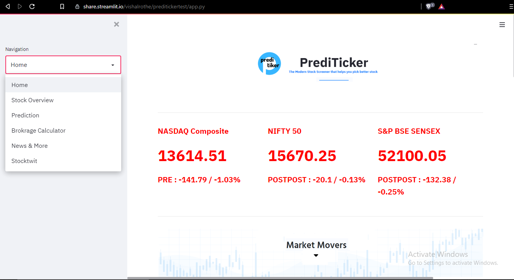
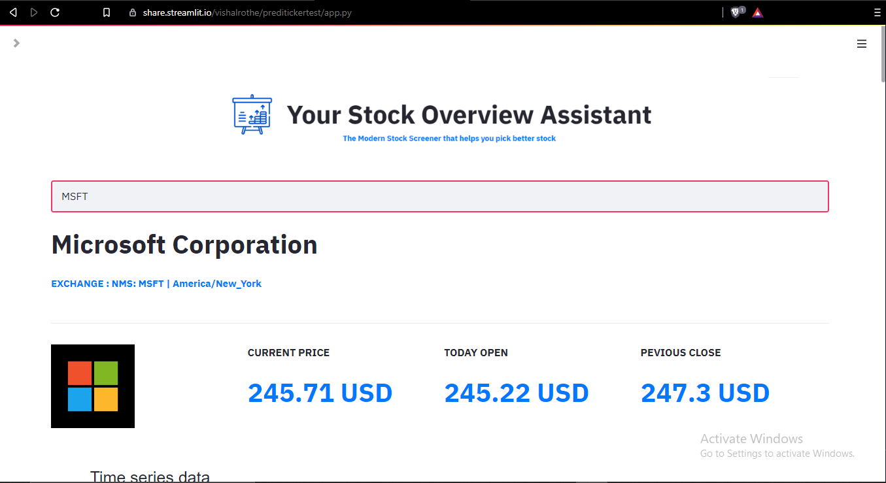
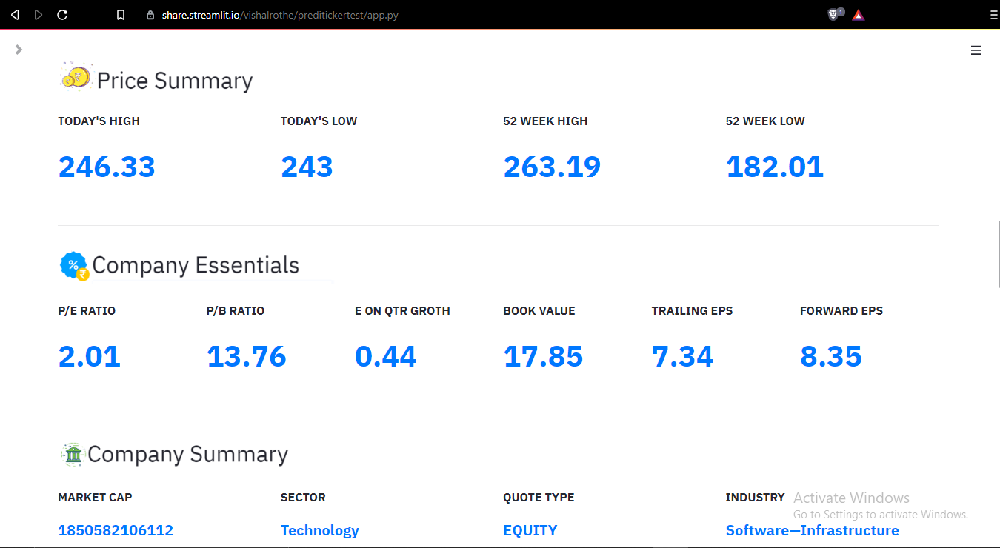
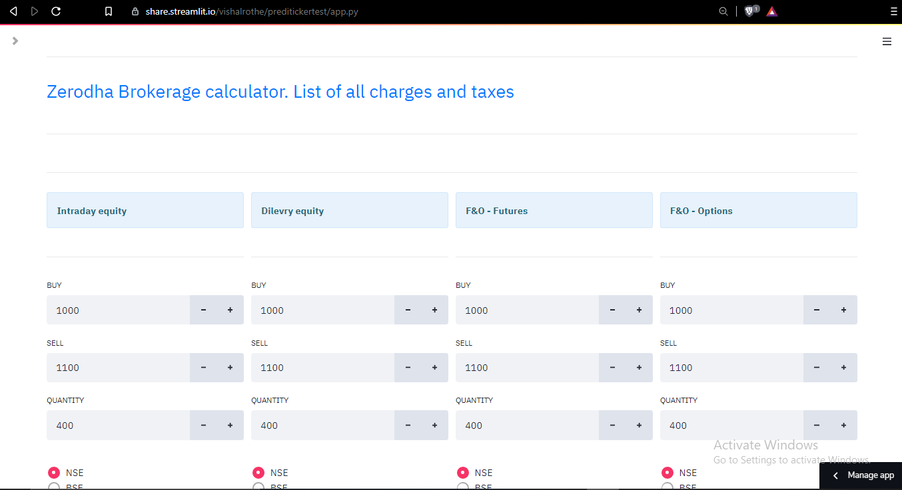
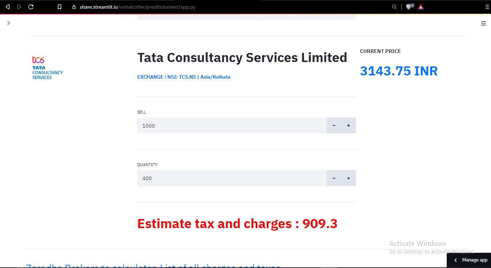
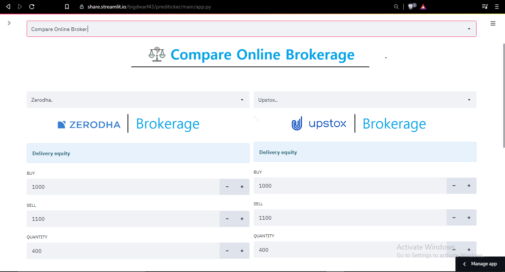

# Prediticker

Prediticker is a application made on top of streamlit which provides a base for doing fundamental analysis of a stock.
We made prediticker for our final year diploma project, you can access the project report from [here](https://github.com/bigdwarf43/Prediticker/files/7710735/finalPreditickerReport.odt)

