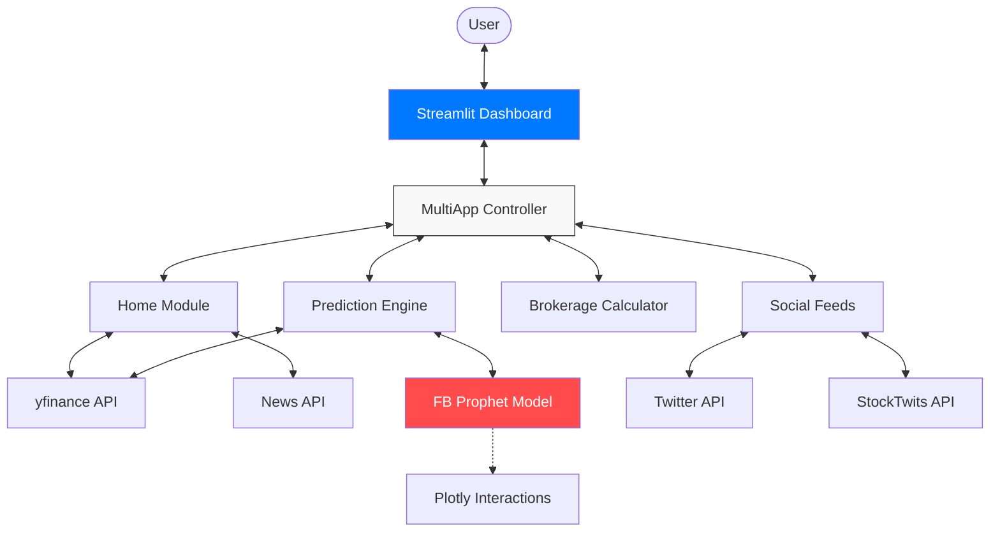
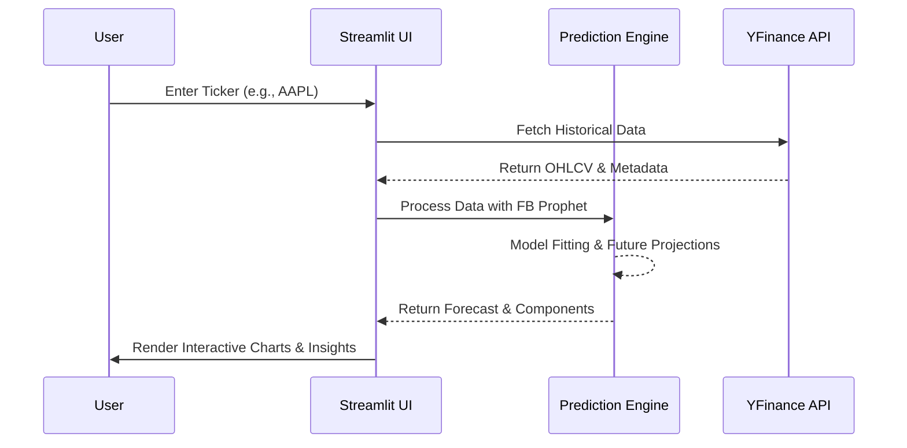
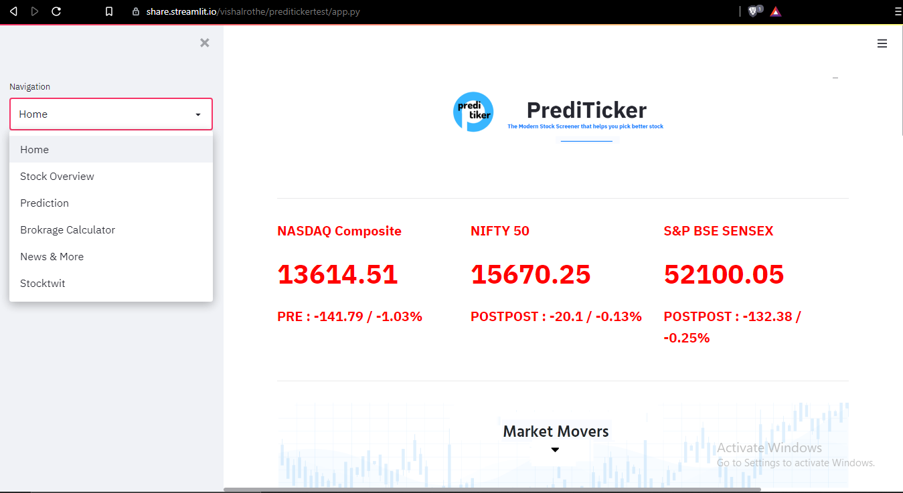
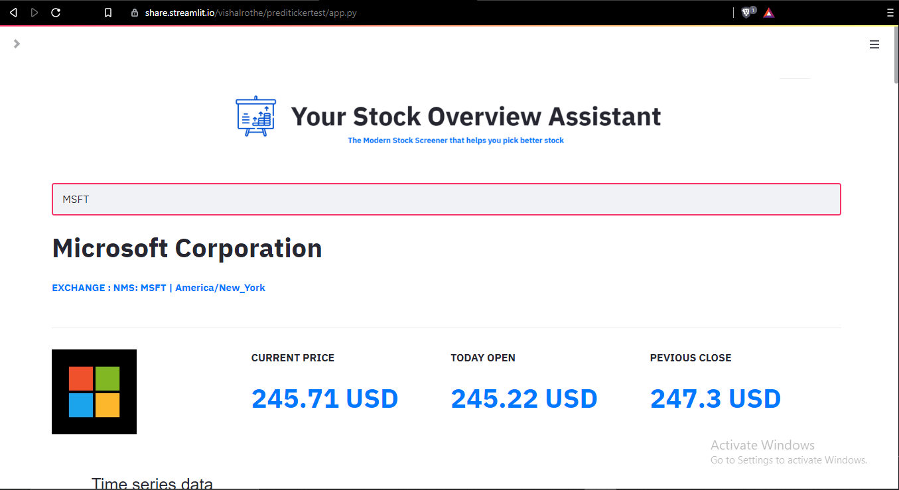
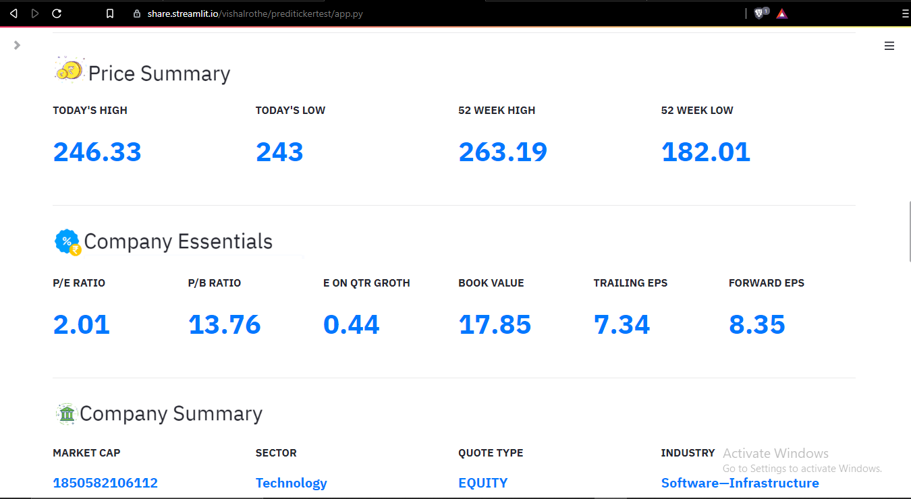
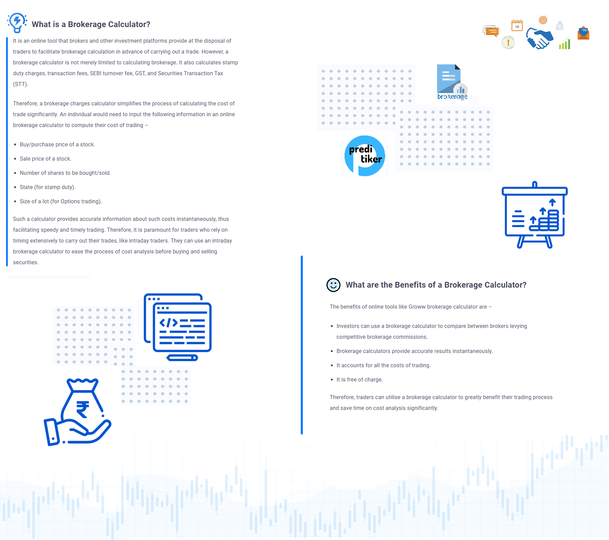

<div align="center">
  
  <h1>PrediTicker</h1>
  <p><strong>The Modern Stock Screener & AI-Powered Prediction Suite</strong></p>
  
  [](https://www.python.org/downloads/)
  [](https://streamlit.io/)
  [](LICENSE)
</div>

## 🚀 Overview

**PrediTicker** is a high-performance stock screening and analysis platform designed for modern traders. It combines real-time financial data, social sentiment analysis, and machine learning-powered price forecasting into a sleek, unified dashboard. Whether you're a day trader or a long-term investor, PrediTicker provides the tools you need to make data-driven decisions.

## 🏗️ Architecture Diagram


```mermaid
graph TD
    User([User]) <--> UI[Streamlit Dashboard]
    UI <--> MA[MultiApp Controller]
    MA <--> Home[Home Module]
    MA <--> Pred[Prediction Engine]
    MA <--> Calc[Brokerage Calculator]
    MA <--> Social[Social Feeds]

    Home <--> YF[yfinance API]
    Home <--> News[News API]

    Pred <--> YF
    Pred <--> Prophet[FB Prophet Model]

    Social <--> Twitter[Twitter API]
    Social <--> ST[StockTwits API]

    Prophet -.-> Plotly[Plotly Interactions]

    style UI fill:#0078ff,color:#fff
    style MA fill:#f9f9f9,stroke:#333
    style Prophet fill:#ff4b4b,color:#fff
```

## 🔄 Execution Flow


```mermaid
sequenceDiagram
    participant U as User
    participant S as Streamlit UI
    participant P as Prediction Engine
    participant Y as YFinance API

    U->>S: Enter Ticker (e.g., AAPL)
    S->>Y: Fetch Historical Data
    Y-->>S: Return OHLCV & Metadata
    S->>P: Process Data with FB Prophet
    P-->>P: Model Fitting & Future Projections
    P-->>S: Return Forecast & Components
    S->>U: Render Interactive Charts & Insights
```

---

## ✨ Key Features

- **📊 Real-time Market Pulse**: Instant tracking of global indices (NASDAQ, NIFTY 50, BSESENSEX) and live gainers/losers.
- **🔮 AI Price Forecasting**: Leverages **Facebook Prophet** for state-of-the-art time-series stock price predictions.
- **📈 Advanced Visualization**: Interactive, high-resolution charts powered by **Plotly**.
- **🐦 Social Sentiment**: Real-time feeds from **Twitter** and **StockTwits** to gauge market emotion.
- **🧮 Brokerage Calculator**: Accurate cost estimation for leading Indian brokers (Zerodha, Upstox, Groww).
- **📰 Global News Feed**: Integrated news module fetching latest business headlines.

## 🛠️ Technology Stack

| Category          | Technology                                        |
| :---------------- | :------------------------------------------------ |
| **Frontend**      | [Streamlit](https://streamlit.io/)                |
| **ML Engine**     | [FB Prophet](https://facebook.github.io/prophet/) |
| **Data Sources**  | `yfinance`, `yahoo_fin`, `tweepy` (Twitter API)   |
| **Visualization** | [Plotly](https://plotly.com/)                     |
| **Backend**       | Python 3.8+                                       |

---

## 📸 Screenshots

<div align="center">
  <h3>Home Dashboard</h3>
  
  <br><br>
  <h3>Stock Intelligence</h3>
  
  <br><br>
  <h3>AI Forecasting</h3>
  
  <br><br>
  <h3>Brokerage Cost Analysis</h3>
  
</div>

---

## ⚙️ Setup & Installation

Follow these steps to set up PrediTicker on your local machine:

### 1. Prerequisites

- Python 3.8 or higher
- [Conda](https://docs.conda.io/en/latest/miniconda.html) (Recommended)

### 2. Clone the Repository

```bash
git clone https://github.com/yourusername/Prediticker.git
cd Prediticker
```

### 3. Environment Setup

Create a new environment using the provided `environment.yml`:

```bash
conda env create -f environment.yml
conda activate preditickertest
```

### 4. Configure API Keys (Optional but Recommended)

Edit `config.py` to include your own Twitter API keys for social features:

```python
TWITTER_CONSUMER_KEY = 'your_key_here'
TWITTER_CONSUMER_SECRET = 'your_secret_here'
...
```

### 5. Run the Application

```bash
streamlit run app.py
```

---

## 🤝 Contributing

Contributions are welcome! Please feel free to submit a Pull Request.

## 📄 License

This project is licensed under the MIT License - see the [LICENSE](LICENSE) file for details.

---

<div align="center">
  Built with ❤️ by the PrediTicker Team
</div>
